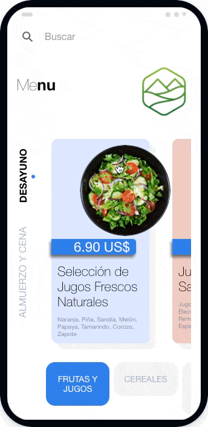

# Menu App
---
[](https://github.com/gconesa/menu_app)

Plataforma desarrollada con [Ionic](https://ionicframework.com/) con el fin que hoteles, cafeterías y restaurantes, puedan mostrar sus menús. Concebida como una plataforma web tambien puede ser utilizada en aplicativos para IOS y Android. La carga y administración del menu se hace através de un excel, con el fin de no ser dependiente de un desarrollador para actualizar el menu.




## Demo
---
Puede revisar la plataforma en el siguiente [link](https://gconesa.github.io/menu_app_web/)

## Instalación y Configuración
---
Para realizar la instalación descárgate el respositorio [https://github.com/gconesa/menu_app_web.git](https://github.com/gconesa/menu_app_web.git)

### Configuración

Primero abre el archivo [index.html](https://github.com/gconesa/menu_app_web/blob/main/index.html) y cambia la siguiente etiqueta
```html
<base href="/menu_app_web/"/>
```
Pon el nombre de tu carpeta donde va a estar alojado, es decir si el menu va a estar alojado en **hotelcode.com/menu** la etiqueta quedaría
```html
<base href="/menu/"/>
```
---

Segundo ve a la carpeta [assets/img](https://github.com/gconesa/menu_app_web/tree/main/assets/img) y remplaza el archivo [assets/img/logo.png](https://github.com/gconesa/menu_app_web/blob/main/assets/img/logo.png) por el logo de tu negocio. **Cuidado el archivo se debe de llamar de la misma forma es decir logo.png**

---

Tercero edita el excel [assets/menu/menu.xlsx](https://github.com/gconesa/menu_app_web/blob/main/assets/menu/menu.xlsx) y introduce el menú de tu negocio. ***Es importante que se respete el formato y la ubicación del excel.***

---

Por último sube la plataforma a tu hosting.

---


